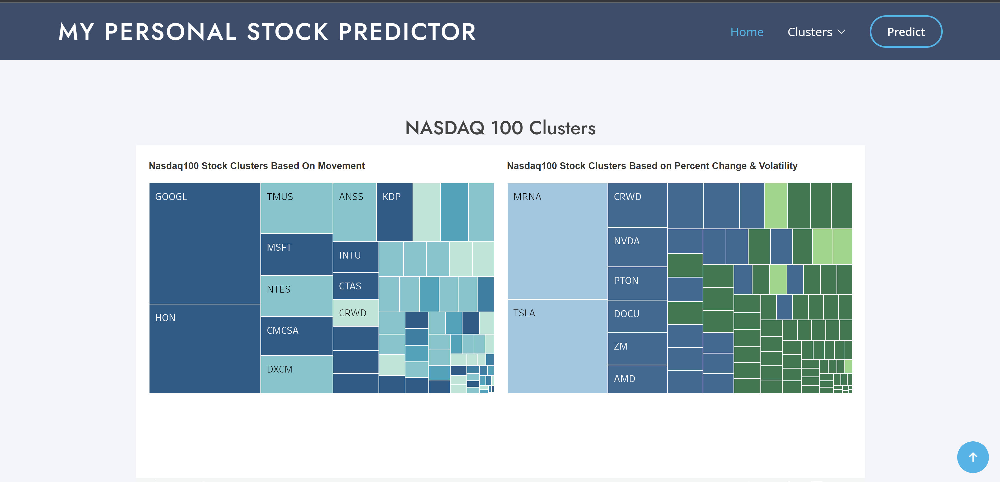
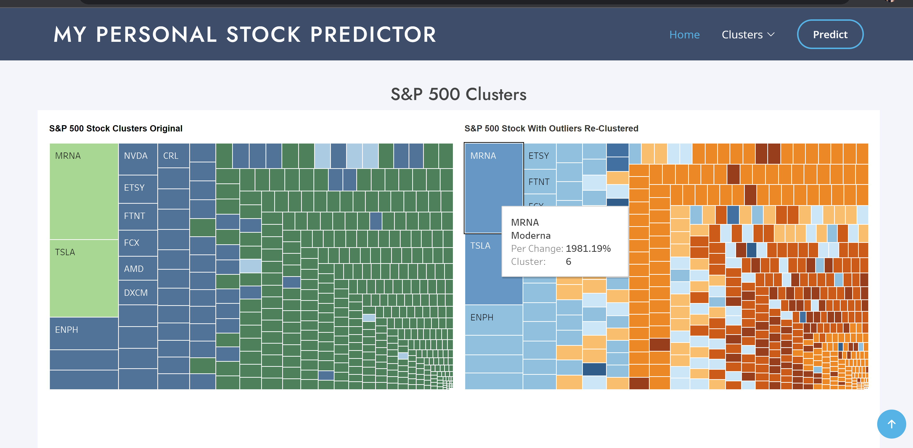
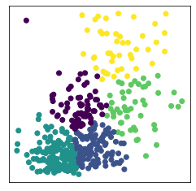
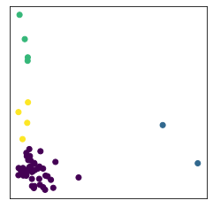

# Project-4
____________________________________________________
## Stock Clustering and Prediction : A Machine Learning Project

____________________________________________________

## Contributors: 
**Vasantha Mutyala (V-MalM) / Valense Acquah-Louis (Tema-2021) / Saiyid Kazmi (saiyidmkazmi)  / Debra Potts (dschoen24)**

## Objective
* The essence of this project is incorporating the magic of Machine Learning in the realm of stock analysis, a daunting task itself. Investing in stocks continues to be risky because of their unpredictable nature. Some factors that contibue to this uncertainity are human phycology, natural calamities, change in political scene, pandamic, war etc.
We will be doing a technical analysis for this project.
Our final objective is to visualize the results of not only clustering stocks with similarities as well as predict and compare the results of our prediction against real-data. 

* We will be using LSTM for our prediction model using time series data.

## Time Series

* Time series is a sequence taken at successive equally spaced points in time. It allows one to see what factors influence certain variables from period to period, for example, how the daily closing value of a stock,changes over time.
* Other examples of time series are heights of ocean tides, daily, weekly, monthly sales. 

## Components of time series
* Trend (how data is increasing or decreasing over time) 
* Seasonality (variations specific to a particular time frame)

## Our Timeseries analysis includes 

## Pattern and outlier detection 
* Used clustering to make diverse stock portfolios by detecting patterns in stocks that move similarly with an underlying trend i.e., for an given period of time how stocks trend together. The analysis was based on 3 indices S&P 500, NASDAQ 100 and DOW 30.

<strong><h2>Click here for K-Means Clustering</h2></strong>

Clustering is an Unsupervised Machine Learning process that splits a dataset or observations into groups that are like each other.
The clustering was performed on the datasets using K-Means and PCA on 3 different calculated features.
* Movement
* Percent Change
* Volatility

K-Means is an SkLearn/ SciKit-Learn model. This model aims to group several observations / datasets into clusters (K-Clusters) where each observation within the cluster shares similarities like
* Mean
* Variance
* Patterns etc.
K-Means identifies the number of centroids in the dataset then assigns the nearest cluster where the centroids remain as small as possible.

<!--  -->

### Movement

Movement is a measure of identifying the trend direction of a stock. It is measured by determining the average changes in open and close price of the stock to help determine if the stock is going in an uptrend (rising movement) or downtrend (declining movement). 

Using Movement as a feature, clustering was performed on the three stock indices resulting in charts displayed here. 

From the image of the various indices S&P500 and NASDAQ100 can be grouped into 5 clusters to represent the various stocks that are moving in the same direction whereas DOW30 has 3 clusters.

### Percentage Change And Volatility
Percent change measures the difference of closing price from the beginning of a time period to the end of a time period.  
Volatility is the reflection of the degree to which price moves. Volatility was calculated using Standard Deviation.

**Visualization**  
Within Tableau,two separate Treemap charts were created for each of the indices - S&P 500, Nasdaq 100 and Dow 30.
The first Treemap chart is based on Market Movement (the change in share prices based on supply & demand) which we categorized by color diversity for each cluster within the index. 
The second Treemap chart is based on percent change (returns) and volatility which we also categorized by color diversity for each cluster within the index.  

### Outliers 
Outliers for our project were stocks that differ from all the other stocks so are detached from the other stocks.
looking at the percent change and volatility Treemaps for S&P500, it was observed that the data was skewed. The treemap on the right is representing the data after being reclustered.

Does the skewed data can affect the clustering? What steps can be taken to separate the outliers and get better clusters without compromising our Data.

The original scatter plot (S&P500) of the data as it has the outliers we do not get a clear or distinct visualization of our clusters due to the outliers. So steps were taken to separate the clusters. 

Using quartiles, the upper and lower bounds of the returns and volatilities of the dataset.
The records above and below the upper and lower bounds were removed to obtain a new dataset. This dataset was then scaled and clustered using KMeans and an elbow curve was plotted.

A scatter plot of the dataset with no outliers was plotted and clear clusters can be seen.

<strong><h2>Click here for Forecasting</h2></strong>

We built a LSTM model to predict next day closing price for a given stock.

## Why LSTM?
Traditionally, models like ARIMA (AutoRegressive Integrated Moving Average) has been used for time series analysis. ARIMA requires data to be stationary by removing trend and seasonality. LSTM, on the other hand, can work with non-stationary data and hence, its was our choice.

## Source of Data  

* We sourced our data from Yahoo Finance’s realtime stock price dataset using Pandas Datareader, a Python package that allows us to create a pandas DataFrame object by using various data sources from the internet. It is popularly used for working with realtime stock price datasets.
Our model is built on using 5 years of data.

* Used 120 days moving window. That means , the model takes in 120 days of close prices and predicts the closing price for 121st day.

**Moving window explained:**  
In our project, the first data point is the first 120 days of data.
The second data point is the first 121 days of data but not including the first.
The third data point is the first 122 days of data but not including the first and second. And this pattern continues for all the dates of the given period (5+ years).

**Data prep**  

Reads real-time data from Yahoo Finance and read it into a Dataframe using Pandas Datareader.
Checked to make sure Date is index.
Checked for nulls and sort data on Date(index) just to be sure it is in ascending order.
Close price has been used for our analysis. 
Isolated ‘Close’ Price from dataset and converted into an array.

Performed adfuller test to check if our data is stationary or non-stationary. We are doing this to see how well the model would perform even on a non-stationary dataset.

**Scale the data**  
Split Data , we did a 75%, 25% split

**Build X_train, y_train following moving window method**  
#### convert X_train and y_train to numpy arrays for LSTM
#### LSTM network expects a 3D input (No_of_Samples, number of time steps, and number of features) no_of_features = 1 (Close)

X_train = np.reshape(X_train, (X_train.shape[0], X_train.shape[1], 1))

**Build LSTM Model**  
We built an LSTM with 2 layers, each with 50 nodes, a dropout layer, 1 dense layer and one output layer with one unit.
Used 'adam' as optimizer, 'mean_squared_error' as loss function 
Trained our Model

After testing accuracy, we saved our model. 
Then we built our test data set .

Predicted price for X_test.
Calculated root mean square error for both training and test data.
Used scaler.inverse_transform to transform predictions .
Compared predited close price with actual close price.
Plotted training, test and actual data.
Below is a quick demonstration of how our model has predicted.

